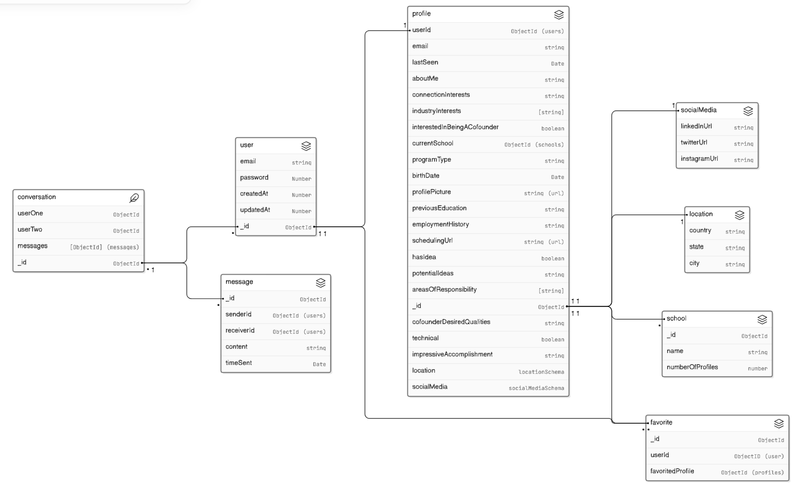
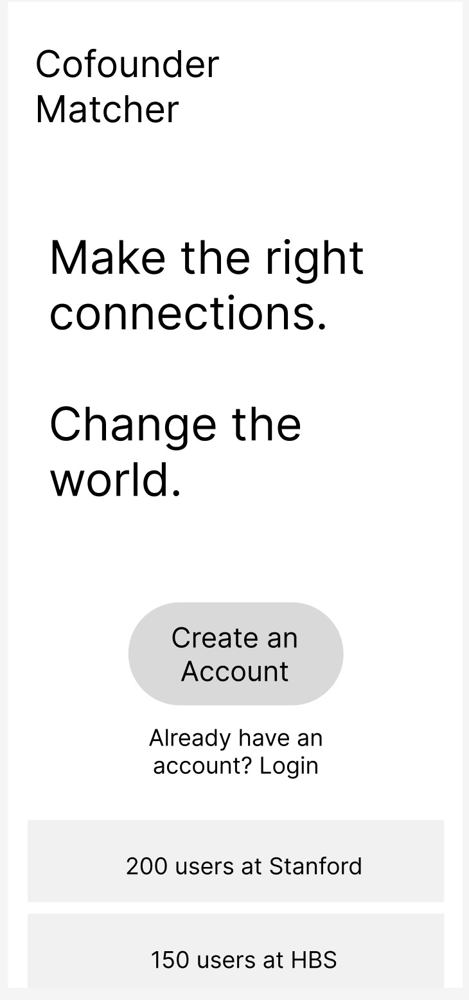
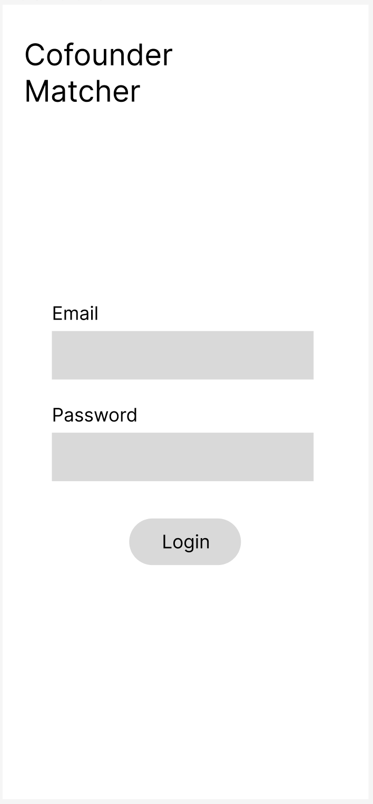
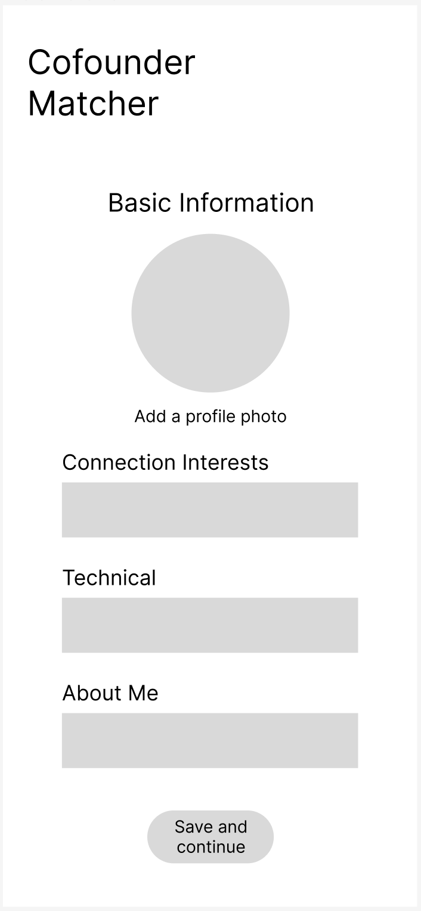
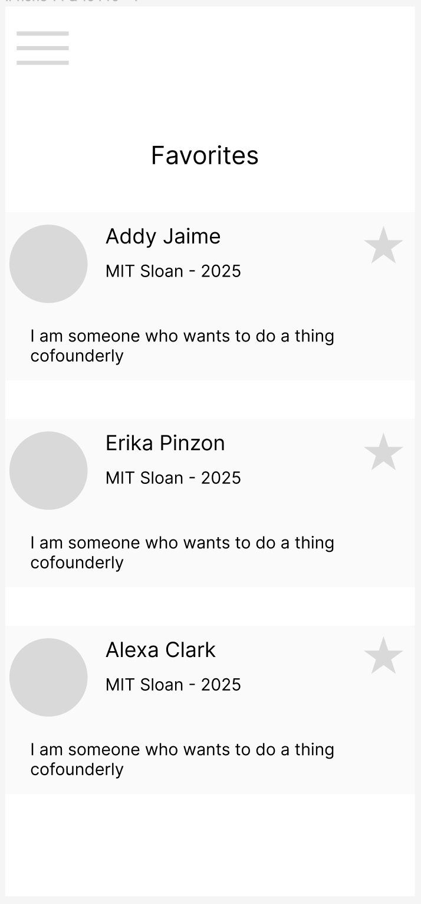
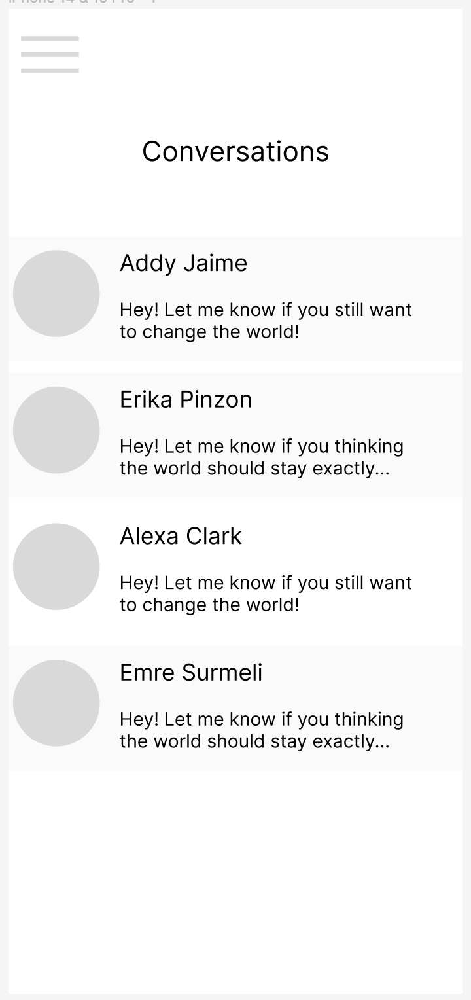
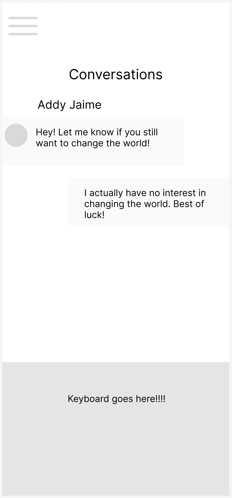
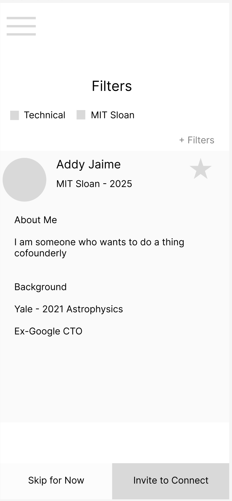
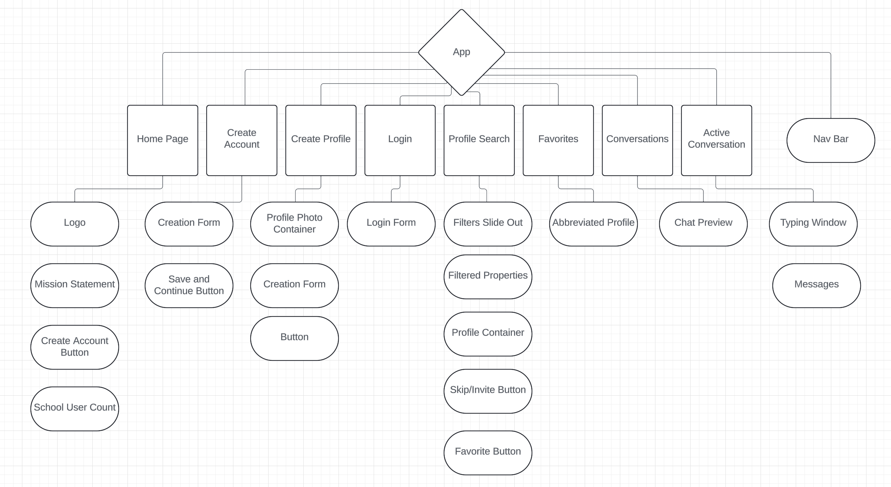

# Cofounder Matcher

## Description

This is an application to enable students to find and connect with other people on their campuses that are also interested in founding or working on a new business. User will able to create a profile containing information about their interests, ideas and skills. Users can view other profiles and initiate conversations with others.

## User Stories - MVP

#### As a User

* AAU, I would like to be able to create a profile so that I can tell others about my interests and skills
* AAU, I would like to search and filter the profiles of other users to match with them
* AAU, I would like to be able to view the details of another users profile
* AAU, I would like to be able to have a chat managed directly within the application for 1-1 communication
* AAU, I would like to be able to save profiles to favorites
* AAU, I would like to be able to update my profile
* AAU, I would like to abe able to delete my account
* AAU, I would like to be able to log in and out

## User Stories - Stretch Goals

#### As a User

* AAU, I would like to be able to send a request to start a conversation with another user
* AAU, I would like to be able to save a project outline
* AAU, I would like to able to generate a shareable link to my outline that I can send to other users
* AAU, I would like to search and filter project ideas

#### As an Admin

* AAA, I would like to be able manage users and content

## ERD

[View ERD on Eraser](https://app.eraser.io/workspace/mBdlNoMANSN8HNMNumZn)

## Wireframes

#### Home Page

#### Create Account

#### Login

#### Profile Creation Page

#### Favorites

#### Inbox (Chat)

#### Active Conversation

#### Profile Search/List

## Component Hierarchy Diagram

#### Diagram

#### Frontend Routes

* Home Page - Route to='/home' element={- Home />} />
  * Logo
  * Mission Statement
  * Create Account Button
  * School User Count Boxes
* Create Account Page - Route path='/create-account' element={- CreateAccount />} />
  * Creation Form
  * Save and Continue Buttom
* Create Profile Page - Route path='/profile' element={- Profile />} />
  * Profile Photo Container
  * Creation Form
  * Submit Button
* Login Page - Route path='/login' element={- Login />} />
  * Login Form
  * Submit Button
* Profile Search Page - Route path='/profile-search' element={- ProfileSearch />} />
  * Filters Pop Out
  * Filtered Properties List
  * Profile Container
  * Skip Button
  * Invite Buttom
  * Favorite Button
* Favorites Page - Route path='/favorites' element={- Favorites />} />
  * Abbreviated Profiles Containers
* Conversations Page - Route path='/conversations' element={- Conversations />} />
  * Chat Preview Containers
* Active Conversation Page - Route path='/active-conversation' element={- ActiveConversation />} />
  * Typing Window
  * Message Containers

## Team Expectations

[Team Expactations Document](https://docs.google.com/document/d/1x4fUAaMDLckjXVp3b591UxO4_F7pSIRwvvLP4xvhZ2o/edit?usp=sharing)

## Task Management

[Link to Trello Board](https://trello.com/b/oYRY42X9/sei-unit-3-project)

## Timeline

| Day       |   | Task                                                                           | Status | Notes |
|-----------|---|--------------------------------------------------------------------------------|--------|-------|
| Friday    |   | Create proposal, make ERD, make CHD, front-end Wireframes                      | To Do  |       |
| Monday    |   | Create backend file structure, connect to database, build all Models and Auth  | To Do  |       |
| Tuesday   |   | Write all controllers, helper functions and services                           | To Do  |       |
| Wednesday |   | Create front end file structure, create pages and components, deploy app       | To Do  |       |
| Thursdary |   | Break into partners/individual work, create chat functionality                 | To Do  |       |
| Friday    |   | Wrap up work on MVP, debug and polish                                          | To Do  |       |
| Saturday  |   | Work on stretch goals                                                          | To Do  |       |
| Sunday    |   | Finalize work on stretch goals, prepare presentation                           | To Do  |       |
| Monday    |   | Present work                                                                   | To Do  |       |

